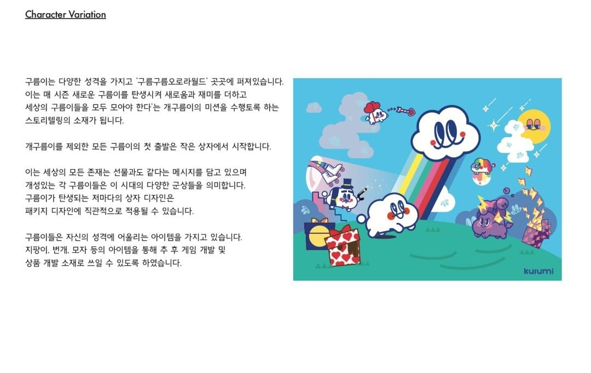
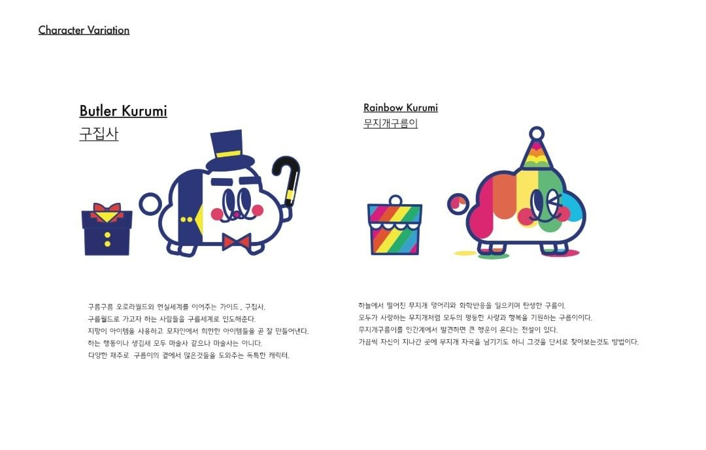
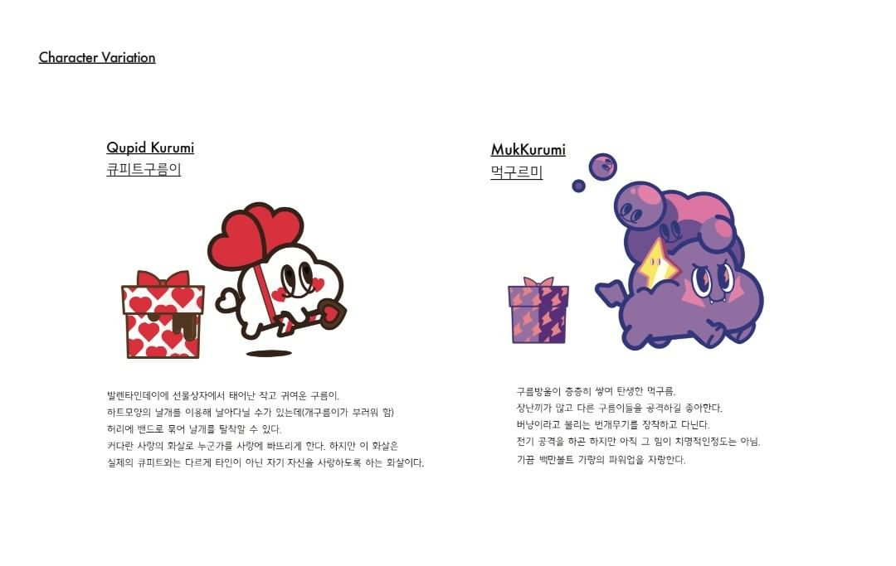

# 요구사항 관리

> 구름 공유하는 플랫폼 ☁️

### 소셜로그인(카카오, 구글, 페이스북, 네이버), 이메일 가입

- 가입은 최대한 간편하고 빠르게
- 서비스 이용하는데 있어 추가 정보가 필요하다면 개인정보 관리 페이지에서 처리
- 이메일 가입시에는 이메일 인증을 필요
- 가입 때 받을 것인가, 가입 이후에 받을 것인가?

### 프로필 페이지

- 프로필 편집
- 내가 어떤 구름들을 몇개 PIN 했는지 통계
- 올린 게시물 출력
- 팔로우 / 팔로워 / 게시물 수
- 인스타나 트위터 밴치마킹

### 계정 팔로우

### 게시물은 인스타와 비슷하게

- 좋아요
- 댓글
- 공유하기
- 해시태그
- 기본 운형 몇가지 제공
- 북마크

### 해시 태그로 게시물 검색

### 게시물 작성 시 세계 지도에 PIN (구름 아이콘) 생성

- 구름 아이콘은 날씨에 따라 각기 다른 아이콘 적용
- 필터링 기능
- 일자별
- 유저별
- ...

### 이 달의 구름 사진 시상

- 시상으로 커피 쿠폰 또는 굿즈 제공
- 이 달의 구름 사진을 상단에 노출
- 인스타그램처럼 피드 볼 수 있게 나열

### 굿즈탭은 [네이버 스토어](https://smartstore.naver.com/kurumishop)로 연결

- 구름 관련 굿즈 판매

### 문학, 예술탭(?) 같은것도 만들어서 구름관련 문학, 회화 작품 큐레이팅

- 사전에 작가님과 상의 필요
- [작가님 관련 기사](http://weekly.chosun.com/client/news/viw.asp?nNewsNumb=002107100029&ctcd=C09)

### 구름에 대한 과학적인 설명을 보여주는 페이지

- [책](https://www.aladin.co.kr/shop/wproduct.aspx?ItemId=222192539) 을 참고하여 작성
- 스크롤로 구름이 피어오르는 과정을 익터렉티브하게 표현 - [BBC 페이지 참고](https://www.bbc.com/korean/resources/idt-48d3c9a7-4063-4289-9726-611b5ea9d7b5)

## 기타

- 수익 구조는 어떻게 나올 수 있을까?
  - 굿즈 판매
  - ...
- 사람들이 게시글에 어떤 내용을 쓰게 만들까?
  - 매월 의미있는 랜덤한 주제를 글 쓸 때 전달해주자.
  - [책바 빌보드](https://www.instagram.com/p/B5o1zrEFxi1/?utm_source=ig_web_copy_link) 참고

## 참고

- https://cloudappreciationsociety.org
- [캐릭터 활용](https://www.instagram.com/lemarong/)
- 르마킴 작가님의 구름 세계관 참고
  
  
  
